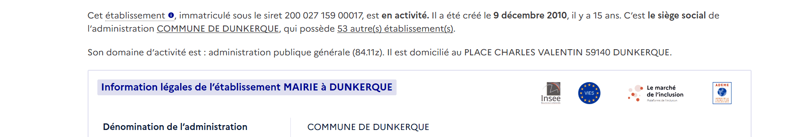
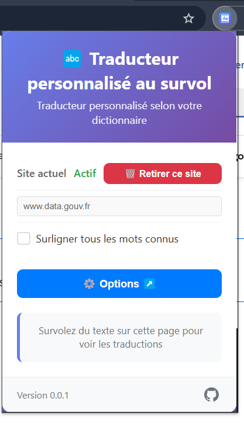

# 🔤 Traducteur au survol

[](https://www.typescriptlang.org/)
[](LICENSE)

Extension de navigateur pour la traduction au survol avec dictionnaire personnalisable.

> **📝 Note importante :** Cette extension utilise l'API WebExtensions standard et est compatible avec Chrome, Firefox, Edge et Safari. Les instructions d'installation varient selon le navigateur.

## Exemples

### Utilisation où le dictionnaire contient la traduction des codes APE



### Extension activable site par site directement



### Configuration dans la page dédiée


### 📋 Utilisation

1. **Configuration** : Ouvrir les options de l'extension
2. **Dictionnaire** : Ajouter vos traductions au format JSON, ou une par une via l'ajout manuel
3. **URLs** : Spécifier les sites cibles (optionnel)
4. **Activation** : L'extension se lance automatiquement sur les pages configurées
5. **Surlignage** : Affichage au survol de vos traductions ou de la recherche inversée

## ✨ Fonctionnalités détaillées

- 🎯 **Traduction au survol** : Affichage élégant des traductions avec bordure bleue
- 📝 **Dictionnaire personnalisable** : Support JSON récursif avec formatage automatique
- 🔍 **Recherche intelligente** : Correspondance exacte et partielle, insensible à la casse
- 🔎 **Recherche globale** : `Ctrl+Maj+F` pour rechercher dans toute la page
- 🌐 **URLs ciblées** : Configuration des sites où l'extension est active
- 🚀 **Cross-browser** : Chrome, Firefox, Safari, Edge
- ⚙️ **Configuration par site** : Options spécifiques par domaine

## 🛠️ Installation

### Développement

```bash
# Cloner le repository
git clone https://github.com/gaboflo/MyHoverCustomTranslator.git
cd MyHoverCustomTranslator

# Installer les dépendances
npm install

# Compiler l'extension
npm run build

```

### Installation sur Chrome/Edge

1. Ouvrir Chrome/Edge et aller dans `chrome://extensions/` ou `edge://extensions/`
2. Activer le **Mode développeur** (toggle en haut à droite)
3. Cliquer sur **"Charger l'extension non empaquetée"**
4. Sélectionner le dossier `dist/` du projet
5. L'extension apparaît dans la barre d'outils

### Installation sur Firefox

1. Ouvrir Firefox et aller dans `about:debugging`
2. Cliquer sur l'onglet **"Ce Firefox"**
3. Cliquer sur **"Charger un module complémentaire temporaire"**
4. Sélectionner le fichier `manifest.json` dans le dossier `dist/`
5. L'extension apparaît dans la barre d'outils

**✅ Vérification de l'installation :**

- L'icône de l'extension doit apparaître dans la barre d'outils
- Cliquer sur l'icône doit ouvrir la popup avec les options
- L'extension doit être listée dans `about:addons` (Firefox) ou `chrome://extensions/` (Chrome/Edge)

**⚠️ Note Firefox :** L'extension est temporaire et disparaîtra au redémarrage de Firefox. Pour une installation permanente, utilisez le fichier `.xpi` (voir section Production).

**🔧 Important pour Firefox :** L'extension inclut un ID explicite (`myhover-translator@gaboflo.fr`) dans le manifest pour permettre le fonctionnement de l'API de stockage.

### Production

- **Chrome/Edge :** Télécharger la dernière release et l'installer via le Chrome Web Store
- **Firefox :** Télécharger le fichier `.xpi` et l'installer via Firefox Add-ons

### 🔎 Recherche globale

Utilisez `Ctrl+Maj+F` sur n'importe quelle page pour ouvrir la barre de recherche. Cette fonctionnalité vous permet de :

- **Rechercher dans toute la page** : Trouvez rapidement tous les mots traduits
- **Navigation visuelle** : Les résultats sont surlignés avec des couleurs distinctes
- **Interface intuitive** : Barre de recherche flottante avec compteur de résultats
- **Fermeture facile** : Cliquez sur ❌ ou appuyez sur Échap pour fermer

**Comment ça marche :**

1. Appuyez sur `Ctrl+Maj+F` sur une page web
2. Tapez votre recherche (minimum 2 caractères)
3. Les résultats apparaissent automatiquement surlignés
4. Le premier résultat est automatiquement mis en évidence
5. Fermez la recherche en cliquant sur ❌

## 📄 Licence

MIT License - voir le fichier [LICENSE](LICENSE) pour plus de détails.

## 🤝 Contribution

1. Fork le projet
2. Créer une branche feature (`git checkout -b feature/AmazingFeature`)
3. Commit les changements (`git commit -m 'Add AmazingFeature'`)
4. Push vers la branche (`git push origin feature/AmazingFeature`)
5. Ouvrir une Pull Request

## 🔧 Dépannage

### Problèmes courants sur Firefox

**L'extension ne fonctionne pas après installation :**

1. Vérifier que l'extension est bien chargée dans `about:debugging`
2. Redémarrer Firefox après l'installation
3. Vérifier les permissions dans `about:addons`
4. Vérifier que l'ID d'extension est présent dans le manifest (déjà inclus)

**Erreur "storage API will not work with a temporary addon ID" :**

- L'extension inclut déjà un ID explicite dans le manifest
- Recharger l'extension dans `about:debugging`
- Redémarrer Firefox si nécessaire

**L'extension disparaît au redémarrage :**

- C'est normal pour les extensions temporaires. Utilisez le fichier `.xpi` pour une installation permanente.

**Les traductions ne s'affichent pas :**

1. Vérifier que l'extension est activée dans les options
2. Vérifier que les URLs cibles sont correctement configurées
3. Ouvrir la console développeur (F12) pour voir les erreurs éventuelles

### Problèmes courants sur Chrome/Edge

**L'extension ne se charge pas :**

1. Vérifier que le mode développeur est activé
2. Recharger l'extension dans `chrome://extensions/`
3. Vérifier que tous les fichiers sont présents dans le dossier `dist/`

## 📞 Support

- 🐛 **Bugs** : [Issues GitHub](https://github.com/gaboflo/MyHoverCustomTranslator/issues)
- 💡 **Suggestions** : [Discussions GitHub](https://github.com/gaboflo/MyHoverCustomTranslator/discussions)
- 📧 **Contact** : [contact@gaboflo.fr](mailto:contact@gaboflo.fr)

---

⭐ **N'oubliez pas de donner une étoile si ce projet vous aide !**
Projet développé avec l'aide de Cursor
